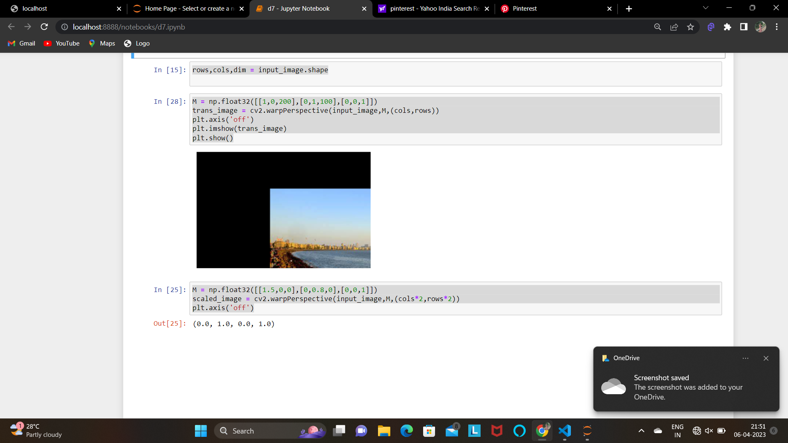

# Image-Transformation
## Aim
To perform image transformation such as Translation, Scaling, Shearing, Reflection, Rotation and Cropping using OpenCV and Python.

## Software Required:
Anaconda - Python 3.7

## Algorithm:
### Step1: 
Import the necessary libraries and read the original image and save it a image variable.
<br>

### Step2:
Create a transformation matrix and apply a perspective transformation to the image amd display the resulting image.

<br>

### Step3:
<br>Similarly Create a perspective matrix for scaling the image and using the appropriate function display the scaled image

### Step4:
<br> Specify the angle of rotation in radians for displaying rotated image and display it.

### Step5:
<br> End the execution .

## Program:
```python
Developed By: VISMAYA.S
Register Number: 212221230125

Reading the image : 

import numpy as np
import cv2
import matplotlib.pyplot as plt
input_image = cv2.imread("d7.jpeg")
input_image = cv2.cvtColor(input_image,cv2.COLOR_BGR2RGB)
plt.axis('off')
plt.imshow(input_image)
plt.show()
rows,cols,dim = input_image.shape

i)Image Translation:

M = np.float32([[1,0,200],[0,1,100],[0,0,1]])
trans_image = cv2.warpPerspective(input_image,M,(cols,rows))
plt.axis('off')
plt.imshow(trans_image)
plt.show()


ii) Image Scaling:

M = np.float32([[1.5,0,0],[0,0.8,0],[0,0,1]])
scaled_image = cv2.warpPerspective(input_image,M,(cols*2,rows*2))
plt.axis('off')
plt.imshow(scaled_image)

iii)Image shearing:

M_x = np.float32([[1,0.5,0],[0,1,0],[0,0,1]])
M_y = np.float32([[1,0,0],[0.5,1,0],[0,0,1]])
sheared_image_xaxis = cv2.warpPerspective(input_image,M_x,(int(cols*1.5),(int(rows*1.5))))
sheared_image_yaxis = cv2.warpPerspective(input_image,M_y,(int(cols*1.5),(int(rows*1.5))))
plt.imshow(sheared_image_xaxis)
plt.imshow(sheared_image_yaxis)

iv)Image Reflection

M_x = np.float32([[1,0,0],[0,-1,rows],[0,0,1]])
M_y = np.float32([[-1,0,cols],[0,1,0],[0,0,1]])
ref_image_xaxis = cv2.warpPerspective(input_image,M_x,(int(cols),(int(rows))))
ref_image_yaxis = cv2.warpPerspective(input_image,M_y,(int(cols),(int(rows))))
plt.imshow(ref_image_xaxis)
plt.imshow(ref_image_yaxis)

v)Image Rotation

angle = np.radians(90)
M = np.float32([[np.cos(angle),-(np.sin(angle)),0],[np.sin(angle),np.cos(angle),0],[0,0,1]])
rot_img = cv2.warpPerspective(input_image,M_x,(int(cols),(int(rows))))
plt.imshow(rot_img)


```
## Output:

### Reading the image :


### i)Image Translation
<br> 
<br>
<br>
<br>

### ii) Image Scaling
<br> 
<br>
<br>
<br>


### iii)Image shearing
<br>
<br>
<br>


### iv)Image Reflection
<br> 
<br>
<br>
<br>


### v)Image Rotation
<br> 
<br>
<br>
<br>


## Result: 

Thus the different image transformations such as Translation, Scaling, Shearing, Reflection, Rotation and Cropping are done using OpenCV and python programming.
